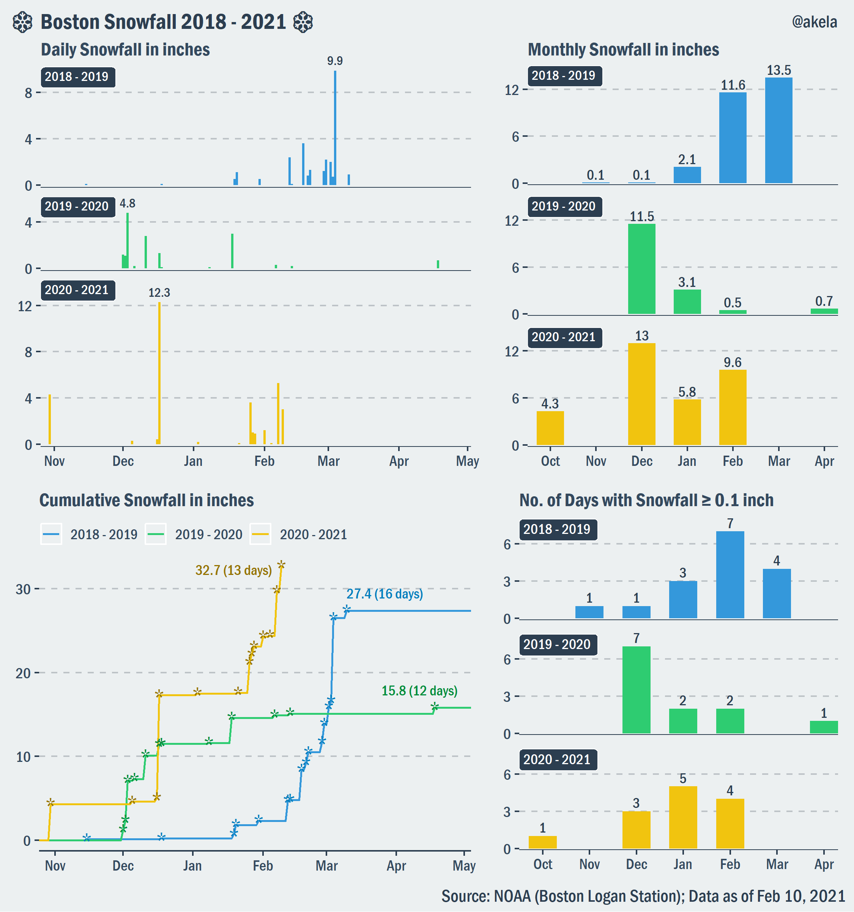

# Boston Snowfall (Nov. 2018 - Feb. 2021)
* Data Source: [NOAA (Boston Logan Station)](https://www.ncdc.noaa.gov/cdo-web/datasets/GHCND/stations/GHCND:USW00014739/detail)
* R packages: ggplot2, gridExtra, grid, ggthemr, extrafont

